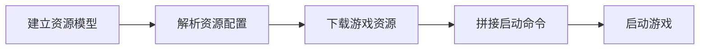

## 引言

想必大家都知道`Minecraft`这个游戏，它是一个非常有趣的游戏，有没有想过它是如何启动的呢？在本系列中，我们将使用`Rust`编写一个简单的`Minecraft`启动器。

本系列文章涉及的`Rust`知识并不多，了解`Rust`的基本语法即可，如果你对`Minecraft`或者`Java`有一定了解，那么会更容易理解本系列的内容。

## 启动方法

首先`Minecarft`是使用`Java`编写的，所以我们需要通过执行`Java`命令来启动`Minecraft`，并且也需要添加一些参数，比如游戏的一些资源文件，`Java`的一些参数等等。

大概就像这样：

```shell
java -Xmx10745m -cp "minecraft.jar;lib/*" -Djava.library.path="natives" net.minecraft.client.main.Main --username yourname --version 1.21
```

### 下载资源

第一步我们需要下载`Minecraft`的资源文件，包括游戏本体、依赖库、资源文件。

`http://launchermeta.mojang.com/mc/game/version_manifest.json`这个地址可以读取到游戏所有版本。

`https://piston-meta.mojang.com/v1/packages/<sha1>/<version>.json`这个地址可以获取到游戏的配置信息。

`http://resources.download.minecraft.net/<sha1_first_two>/<sha1>`这个地址可以获取到游戏的资源文件。

`https://libraries.minecraft.net/<group>/<artifact>/<version>/<artifact>-<version>.jar`这个地址可以获取到游戏的依赖库。

### 拼接命令

完成以上步骤后，我们就可以拼接命令了，首先是`java`的程序路径，然后是`JVM`参数，然后是`classpath`，接着是`main`方法的类路径，最后是`Minecraft`的参数。

拼接完成之后就可以执行这个命令启动游戏了。

## 项目结果

本项目分为 4 个模块：`download`, `launch`, `model`, `parse`。

- `download`模块用于下载游戏资源文件。

- `launch`模块用于启动游戏。

- `model`模块用建立游戏的数据模型。

- `parse`模块用于解析游戏的配置文件(可有可无，用来测试建立的模型是否正确)。

## 流程

